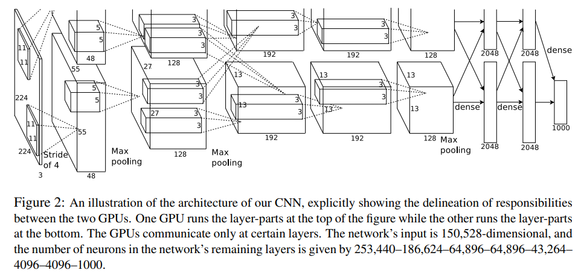
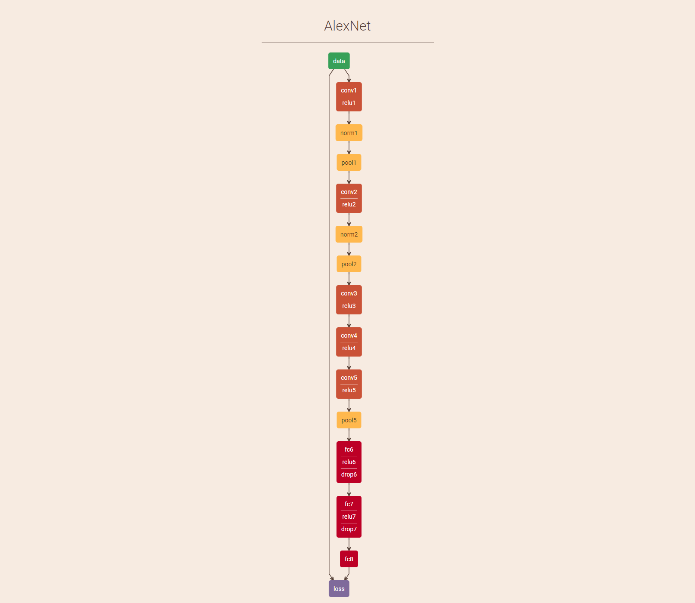
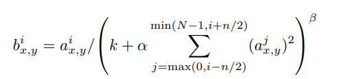

[ImageNet Classification with Deep Convolutional Neural Networks](https://papers.nips.cc/paper/4824-imagenet-classification-with-deep-convolutional-neural-networks.pdf)

AlexNet是2012年ILSVRC的冠军模型，top-5 error rate达到15.3%，甩了第二名10.8%，完全碾压其他传统的依赖hand-craft特征的计算机视觉方法。它的出现绝对是深度学习的里程碑，这是第一次在大规模的数据集上实现了深层卷积网络的结构，从此开始了深度学习的热潮。

## 网络结构

AlexNet总共有8哥权重层，其中包括5个卷积层和3个全连接层。

第1、2卷积层后连有LRN(Local Response Normalization)层，每个LRN及最后层卷积层后跟有最大池化层，并且每个权重层均有RELU激活函数。全连接后使用dropout解决过拟合。

|  layer   | Stride | Kernel size | feature map | PADDING |
| :------: | :----: | :---------: | :---------: | :-----: |
|  Conv1   |   4    | $11*11*96$  | $55*55*96$  |    0    |
| Pooling1 |   2    |    $3*3$    | $27*27*96$  |    0    |
|  Conv2   |   1    |  $5*5*256$  | $27*27*256$ |    2    |
| Pooling2 |   2    |    $3*3$    | $13*13*256$ |    0    |
|  Conv3   |   1    |  $3*3*384$  | $13*13*384$ |    1    |
|  Conv4   |   1    |  $3*3*384$  | $13*13*384$ |    1    |
|  Conv5   |   1    |  $3*3*256$  | $13*13*256$ |    1    |
| Pooling5 |   2    |    $3*3$    |  $6*6*256$  |    0    |
|   FC6    |        |             |    4096     |         |
|   FC7    |        |             |    4096     |         |
|   FC8    |        |             |    1000     |         |

## 网络特点

1.Training on Multiple GPUs

2.ReLU Nonlinearity

传统神经网络激活函数通常为反正切或是sigmoid，AlexNet使用RELU作为激活函数，相比于反正切，该方法训练速度大约有6倍提升。

3.Local Response Normalization

LRN加在RELU的激活后面，能够增加网络的泛化能力，并在ILSVRC-2012上降低1%的错误率。不过后来的网络证明了LRN并非CNN中必须包含的层，甚至有些网络加入LRN后模型表现反而降低了。

4.Overlapping Pooling

重叠池化是指池化步伐小于kernel size，池化后的feature map的感受野其实是有部分重叠的,文章指出这样做可以防止过拟合。但是，后面的网络鲜有继续使用的，因为有更好的防止过拟合的技术出现，比如BN已经可以解决过拟合的问题。

5.Data Augmentation

使用Random Crop和flip进行数据增强，从而扩充训练样本的数量。具体做法就是将图片resize到$256*256$，然后从中随机crop出$224*224$大小的patch训练；测试时从四个角和中心分别crop，然后水平翻转图像，这就得到了10张测试图片，然后对于这10张测试图片得到的结果取平均值。另一种数据增强方法是转换RGB通道的强度，大约降低了1% error rate，但是这个方法之后的模型很少使用了。

6.Dropout

Dropout通过训练时随机丢弃部分神经元从而减少过拟合的风险。这么做也可以迫使这些神经元去学习互补的一些特征。