Inception networks也是深度学习的重要的奠基石。相比与之前说的AlexNet和VGG，它具有更深更宽更复杂的结构和更优异的表现，但是它的参数量甚至比AlexNet还要少好几倍。目前InceptionNet已经有了四个版本，分别是Inception v1、Inception v2、Inception v3和Inception v4,每一个版本都是对上一个版本的提升。

## Inception v1

paper地址: [Going Deeper with Convolutions](https://storage.googleapis.com/pub-tools-public-publication-data/pdf/43022.pdf)

Inception v1也被称为GoogleNet，它的网络结构是基于inception module构建的。

Inception module的结构如下图所示，

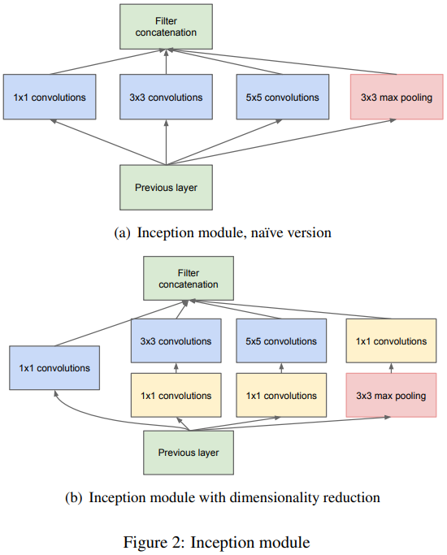

和之前的CNN网络不同，在inception module中，每一层的输入会经过4个并行的卷积层，也就是输出被拷贝成4份，同时提供给4个CNN层。在naive version中，4并行的结构分别为$1 \times 1$的卷积核，$3 \times 3$的卷积核，$5 \times 5$的卷积核和$3 \times 3$的max pooling。为了减少参数，在$3 \times 3$的卷积核和$5 \times 5$的卷积核之前以及$3 \times 3$的max pooling之后都加了一层$1 \times 1$的卷积核，这就是图(b)中的Inception module结构。

可以看到Inception module中大量的使用了$1 \times 1$的卷积核，相比输入，它可以输出更少的特征图，这样起到了降维的作用，可以明显减少参数量，因此称为瓶颈层。当在$3 \times 3$和$5 \times 5$等计算量巨大的卷积层之前使用时，这样的作用尤其明显。同时，$1 \times 1$，$3 \times 3$，$5 \times 5$的并行结构构成了更有效的卷积层，能够获取更复杂的特征。实际上，在对输入图像进行遍历扫描时，这种卷积层的组合结构相当于一个两层的神经网络，而不是简单的线性分类。所以，将Inception module看成是一个卷积层，它可以输出具有不同尺度复杂特征的特征图。

Inception module中，所有层的stride都是1，并且使用了SAME填充，因此，各个层的输出具有相同的尺寸，但深度可以不同。由于各个输出具有相同的尺寸，可以将其沿深度方向叠加，构成深度叠加层，也就是上图中的filter concatenation。

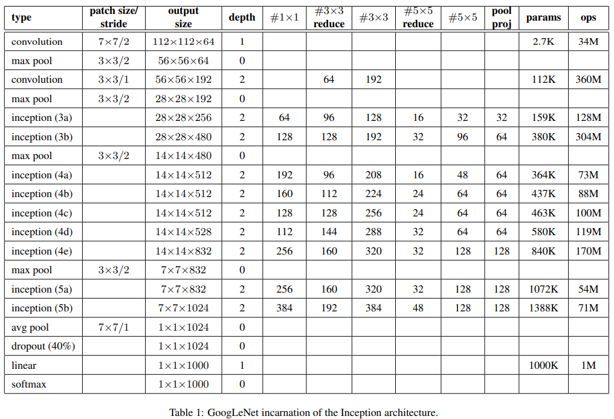

GoogleNet有9个inception module组成，整个网络总共27层，最后一个inception module之后接了global average pooling。同时，在第三和第六个Inception module上，有两个辅助分类器。由平均池化层、卷积层、两个全连接层和一个softmax激活层组成。在训练时，其损失的30%添加到整体的损失中。目的是解决梯度消失问题以及归一化网络。实际上，作用并不大。

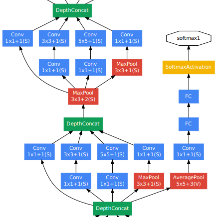

## Inception v2/v3

paper地址: [Rethinking the Inception Architecture for Computer Vision](https://arxiv.org/pdf/1512.00567v3.pdf)

### 卷积核分解

相较于Inception v1， Inception v2进一步改进了Inception module。在CNN网络中，临近的卷积核的输出具有很高的相关性，因此，在输出结果聚合前应该降维，得到相似的局部特征。而且Inception的全卷积网络的每个权重对应一个激活值的一次乘法操作。因此，任何计算开销的减少都将意味着训练参数的减少。这意味着在适当的因式分解下，我们可以得到更多解耦合的参数，这会加快我们的训练。同时，我们可以使用节约下来的计算和存储容量来增加卷积核数量，保持训练开销不变。

- 将大尺寸的卷积核分解成多个小卷积核

  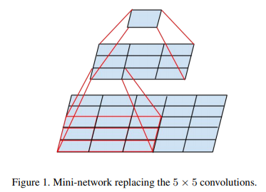

  之前在VGG中提到了同样的技术，2个$3 \times 3$的卷积核可以代替1个$5 \times 5$的卷积核，3个$3 \times 3$的卷积核可以代替1个$7 \times 7$的卷积核。

  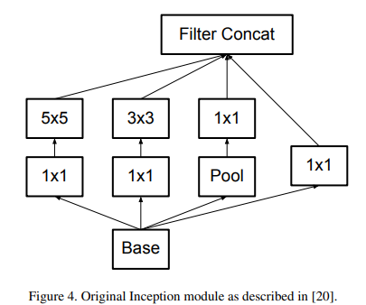

  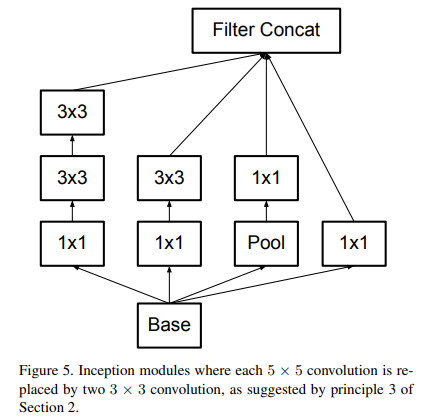

- 将不对称的卷积核进行分解

  可以使用非对称卷积。将$n \times n$的卷积分解成$1 \times n$和$n \times 1$卷积的串联。如下图，$3 \times 3$卷积可以分解为$1 \times 3$和$3 \times 1$卷积，节省33%的计算量。

  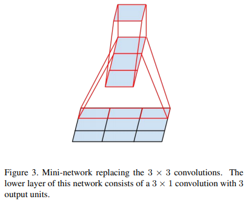

  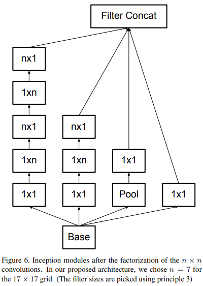

  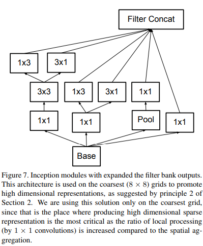

### 高效降维

Inception v2中通过低维嵌入完成空间聚合从而实现高效的降维。

传统的方法包括以下两种：

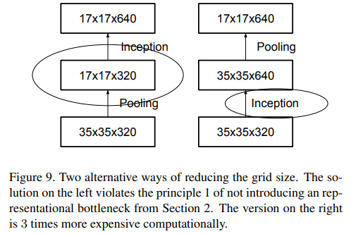

- 先将特征图(通道)数目扩大（一般使用$1 \times 1$卷积），然后再使用池化层来减少特征图(通道)数目，但是$1 \times 1$卷积会有非常大的计算开销。
- 先做池化减少特征图(通道)数目，然后再使用$1 \times 1$卷积对其特征图(通道)数目放大，不过显然首先使用池化会造成信息硬性丢失，在此之后再使用$1 \times 1$卷积去增加特征图(通道)数目就没有太大意义了。

但是，在Inception v2中，作者在降低计算量(即减小特征图大小)的同时，避免表征瓶颈。采用两个并行的、步长为2的模块。其中一个是池化层(最大池化或均值池化)，另一个是步长为2的两个卷积层。这两个模块的输出堆叠在一起构成真正的输出，这样就增大了最终输出的特征图数目。

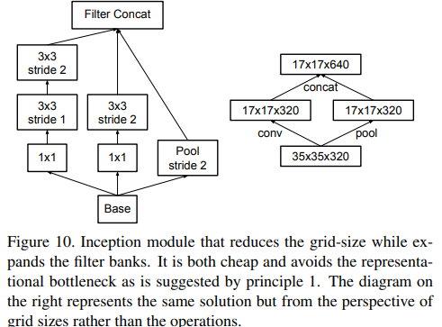

Inception v2的整体结构如下图：

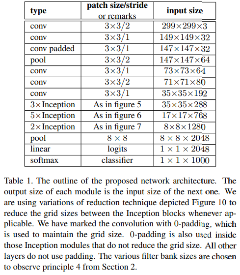

### 辅助分类器的效果

在训练时并没有促进收敛。当训练快结束时，拥有辅助分类器的网络的准确率会比没有辅助分类器的网络的准确率高。
GoogleNet在网络的两个不同的地方设置了辅助分类器。将浅层的那个辅助分类器移走对于网络最后的结果没有任何负面作用，即是无用的。结合前面提到的，GoogleNet提出的辅助分类器能够帮助低层特征训练的假设是错误的。实际上，辅助分类器就是一个正则化方法。如果辅助分类器采用BN或者引入dropout，网络的主分类器能够取得更好的结果，证明了辅助分类器就是一个正则化方法。同时也为BN是一个正则化方法的猜想提供了一点支持。

### [Label Smoothing](https://www.zhihu.com/question/65339831/answer/236892343)

Inception v2中改进了目标函数。原来的目标函数，在单类情况下，如果某一类概率接近1，其他的概率接近0，那么会导致交叉熵取log后变得很大很大。从而导致两个问题：过拟合；导致样本属于某个类别的概率非常的大，模型太过于自信自己的判断。所以，使用了一种平滑方法，可以使得类别概率之间的差别没有那么大。这项改动就是label smooth，提升了0.2%个点。当然这种做法也将背景类暗含进了分类类别中（1000->1001）。

综上，可以总结出Inception v2的四条[设计原则](https://zhuanlan.zhihu.com/p/32702113)：

- 慎用瓶颈层(Inception v1的瓶颈层)来表征特征，尤其是在模型底层。前馈神经网络是一个从输入层到分类器的无环图，这就明确了信息流动的方向。对于网络中任何将输入和输出分开的隔断，都可以评估出通过该隔断的信息量。在网络中，应该避免压缩率较高的瓶颈层。通常，表征尺寸应该从输入到输出逐渐减小，直到表征用来完成当前的任务(识别、分类等)。理论上，信息内容不能只用表征维度评估，因为表征维度作为一个粗略的估计，忽略了相关结构等重要因素。
- 更高维度的表征更容易在网络的局部中处理。增加卷积神经网络中每层的卷积核个数能够获得耦合性更低的特征。这样，获得的各个特征具有高内聚低耦合的特点，能够加速收敛。两个神经元或者神经元系统，如果总是同时兴奋，就会形成一种‘组合’，其中一个神经元的兴奋会促进另一个的兴奋。CNN中位于顶层的各个卷积核就是为了获取这种‘组合’特征，即高内聚低耦合特征。
- 通过低维度嵌入来完成空间聚合，如采用瓶颈层进行特征维度缩减，这样几乎不影响表征能力，但通常限于网络模型顶层部分。例如，在使用$3 \times 3$卷积进行空间聚合时，可以使用瓶颈层降低输入表征的维度，并且几乎没有出现预期的不良后果。作者猜测，网络顶层输出的特征层尺寸较小、信息量丰富，导致各个特征层之间关联性较高，因此降维导致的信息损失很小。鉴于这些信号应易于压缩，降维甚至可以促进更快的学习。
- 平衡网络的宽度和深度。优化网络性能可以认为是平衡每个阶段(层)的卷积核数目和网络深度。在合理分配计算/内存资源的前提下，同时增加宽度和深度能够提升网络性能。

Inception-v2的结构中如果辅助分类器添加了BN，就成了Inception-v3。

## Inception v4

paper地址: [Inception-v4, Inception-ResNet and the Impact of Residual Connections on Learning](https://arxiv.org/pdf/1602.07261.pdf)

Inception v4中将Inception module与ResNet的残差结构相结合，通过残差连接加速Inception网络的训练。提出了两个Inception残差网络，包括Inception-ResNet-v1、Inception-ResNet-v2；一个Inception网络Inception-v4，证明了在算法开销相近时，残差Inception网络比没有残差连接的Inception网络的性能稍稍好一些。

### 纯Inception module

旧的Inception modules以分布式的方式训练，每个副本被分割为多个子网以适应内存空间。然而，Inception结构具有很高的可调性，意味着多个层中卷积核的数目可以任意改变，但并不会影响网络整体性能。为了优化训练速度，作者认真地调节了层的尺寸，通过调节层的尺寸来平衡各个模型子网间的计算量。对比之下，通过引入TensorFlow可以使目前多数模型不必采用分布式训练。这种进展一定程度上归功于反向传播算法的内存优化，即认真地鉴别哪些张量是计算梯度所必须的、采用结构化计算，以此减少张量数量。在此之前，作者对于改变结构选择一直很保守，实验仅限于改变网络模型某个部分，其余部分不变。由于没有简化早期的网络结构选择，导致了网络比实际需要的网络复杂。在作者构建Inception-V4的实验中，抛下了关于改变结构选择的不必要的包袱，为每个网格大小的Inception模块做出统一的选择。

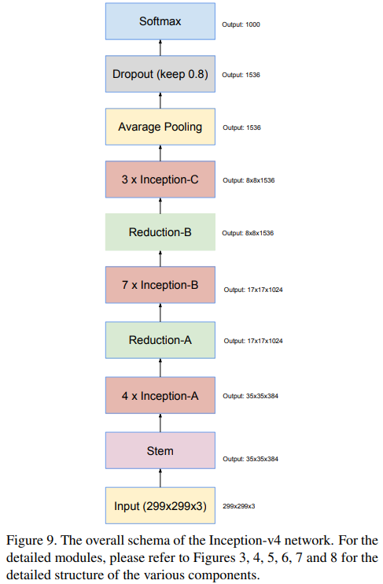

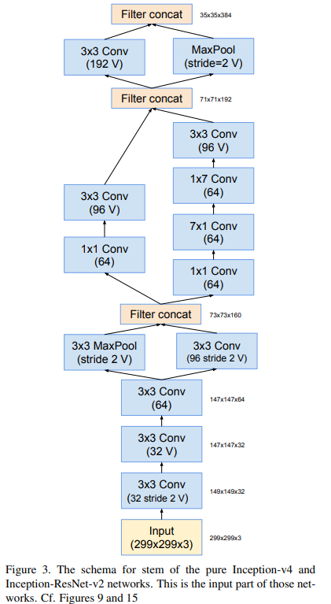

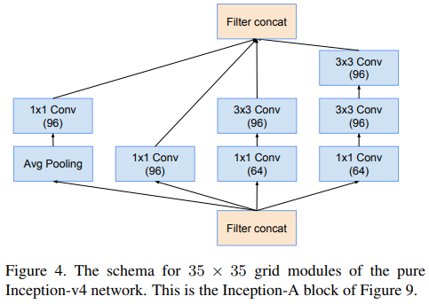

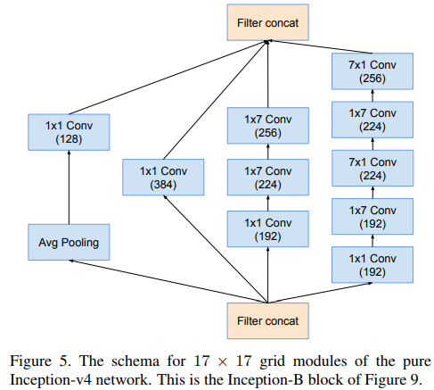

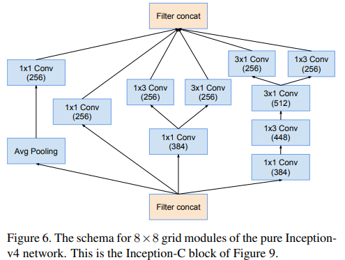

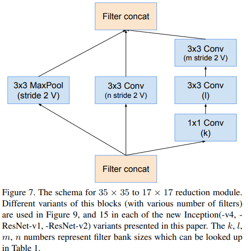

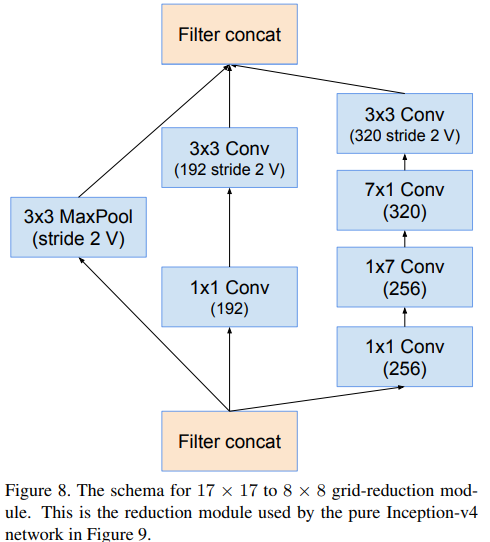

### 残差Inception模块

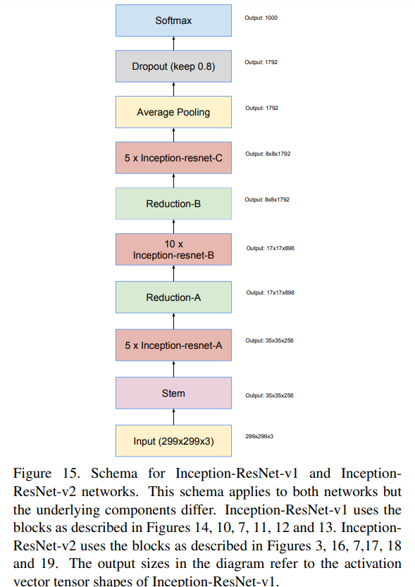

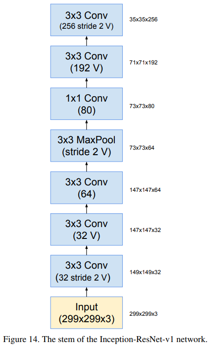

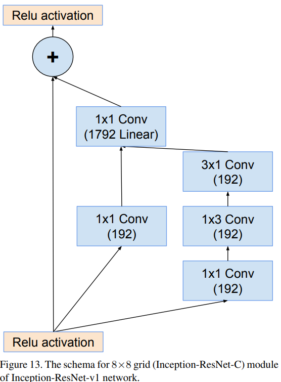

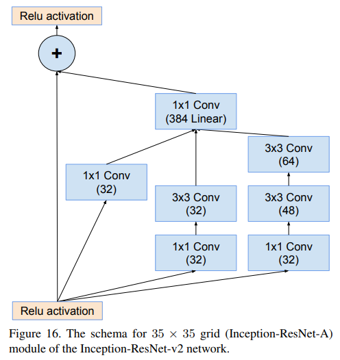

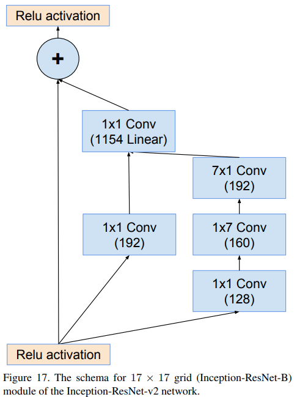

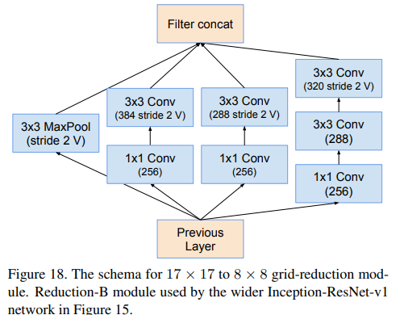

在残差Inception网络中，使用了比原始Inception模块计算开销更低的Inception模块。每个Inception模块后面都添加一个过滤器扩展层(没有激活函数的$1 \times1$卷积层)，在与输入相加之前，用来增加过滤器组的维度(深度)，使其与输入的深度一致。这么做是为了补偿Inception模块产生的降维。

作者尝试了多种残差Inception，文中仅详细介绍两种：Inception-ResNet-v1，计算量与Inception-v3相似；另一种是Inception-ResNet-v2，计算量与新提出的Inception-v4的主体计算量相似。实际中，Inception-v4的单步时间比较慢，可能是拥有大量的层导致。

残差Inception与非残差Inception的另一个技术差异：Inception-ResNet中，仅在传统层上使用BN，并未在完成输入与输出相加的层使用BN。在所有层都使用BN是合理的、有益的，但是为了使每个模型副本能够在单个GPU上训练，并未这么做。事实证明，拥有较大核(激活尺寸/卷积核)的层消耗的内存，与整个GPU内存相比是不成比例的，明显较高。通过去掉这些层的BN操作，能够大幅提高Inception模块的数目。作者希望能够有更好的计算资源利用方法，从而省去Inception模块数目和层数之间的权衡。

### 残差模块缩放

作者发现，如果过滤器数目超过1000，残差网络将变得不稳定，并且网络在训练的早期就‘死亡’了，即迭代上万次之后，在平均池化层之前的层只输出0。即使降低学习率、添加额外的BN层也无法避免。

作者发现，在将残差与其上一层的激活值相加之前，将残差缩放，这样可以使训练过程稳定。通常采用0.1至0.3之间的缩放因子来缩放残差层，然后再将其添加到累加层的激活层。如下图：

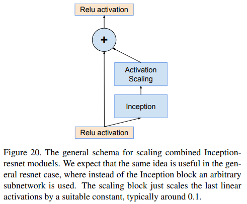

Inception-ResNet modules的通用缩放机制：该机制要适用于常见的ResNet，即使用任意子网代替Inception模块的ResNet。缩放模块仅作用于最后的线性激活值，缩放因子为常数，通常为0.1。

其他深度网络也出现了类似问题。在一个非常深的残差网络中，研究者提出了两阶段训练。第一阶段，称为预热阶段，以较低的学习率训练，然后在第二阶段采用较高的学习率。本文作者发现，如果过滤器数目非常高，即使学习率极低(如0.00001)也无法解决不稳定现象，并且第二阶段较高的学习率很可能降低第一阶段的学习效果，降低模型性能。作者认为使用缩放更为可靠。

尽管缩放在某些地方不是必须的，但是并未发现缩放会降低最终的准确性，而且缩放在一定程度上会使训练变得稳定。

## Reference

https://zhuanlan.zhihu.com/p/32702113

https://zhuanlan.zhihu.com/p/52802896

https://zhuanlan.zhihu.com/p/32702209

https://www.zhihu.com/question/66396783

https://towardsdatascience.com/a-simple-guide-to-the-versions-of-the-inception-network-7fc52b863202