### TLTD

使用ReLU等非线性单元的神经网络相当于一个分片线性函数，线性区域越多，神经网络的非线性就越强，网络的效果可能就更好。这篇文章讨论了在神经元总数一样的情况下，增加网络的深度可以产生更多的线性区域。文章中使用折纸类比了这个过程。

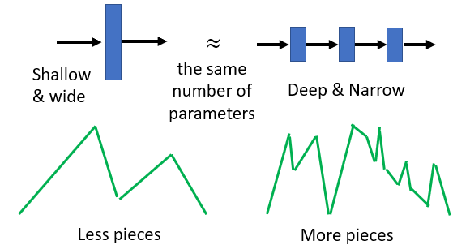

​											source: [李宏毅Deep Structure PPT](http://speech.ee.ntu.edu.tw/~tlkagk/courses/MLDS_2018/Lecture/DeepStructure%20(v9).pptx)

以ReLU为例，我们知道ReLU单元$y=ReLU(Wx+b)$会在输入空间中产生一个超平面$Wx+b=0$,把输入空间分成两部分，一部分的空间输出值为常数0，另一个空间的输出为$y=Wx+b$。可以看到一个分片线性函数会产生两个线性区域。那么如果输入空间是二维，就像一张纸沿着$Wx+b=0$折一下，再打开，会产生两个线性区域。

对于一个具有两个ReLU单元的单隐藏层神经网络，$y_1=ReLU(W_1x+b_1)$和$y_2=ReLU(W_2x+b_2)$，输出为$y=y_1+y_2$。那么这个神经网络就有四个线性区域，每个区域的输出值为0、$W_1x+b_1$、$W_2x+b_2$和$(W_1+W_2)x+(b_1+b_2)$。这就像一张纸，先沿着$W_1x+b_1=0$折一下，打开，再沿着$W_2x+b_2=0$折一下，会产生四个区域。所以如果只有一个隐藏层，单纯地增加神经元的个数，相当于重复上述操作，不断的沿着一条线折一下，再打开。对于一张二维的纸而言，折叠N此所产生的线性区域不超过$\frac{N^2+N}{2}+1$.

对于两个隐藏层的神经网络。第二层的一个ReLU单元会在第二层的输入空间（第一层的输出值域）上形成一个超平面，并将第一层的值域分成两个区域。而我们注意到，第一层可能会把不同的输入映射到相同的输出值，因此在第一层的值域上又多一个区域，就可能再输入空间上多出好几个区域。这就像拿一张纸，折几下，折出几个区域，然后不打开，再折一下。那么最后折的这一下，就会在之前折出的多个区域中新增一个区域。这就是增加层数带来的效果。对于更深层的网络，就像拿一张纸，一直折N次，折到最后才打开，那么这些折痕最多可以把纸分割成$2^N$个区域。

### 1. Introduction & Conclusion

这篇文章研究了深度前馈神经网络可根据它们的线性区域数计算函数的复杂性；讨论了深层模型的每一层都能够识别其输入片段，使得层与层的组合能够识别指数数量的输入区域。这导致指数地复制在更高层中计算的函数的复杂性。深度模型以这种方式计算的函数是复杂的，但是它们仍然具有由复制引起的intrinsic rigidity，这可能有助于深度模型比浅模型更好地泛化到看不见的样本。线性区域的结构取决于单元的类型，例如hyperplane arrangements for shallow rectifier和Voronoi diagrams for shallow maxout networks。在maxout和rectifier网络中，随着深度增加区域数量都指数地增长。给定网络的参数空间被划分为目标函数具有相应线性区域的区域。

在许多隐藏层的渐近极限中，尽管使用相同数量的计算单元，深层网络能够将它们的输入空间分成比浅层网络指数地更线性的响应区域。这篇文章描述了那些模型的中间层如何将它们的几个输入映射到同一个输出。以这种方式计算的函数的分层组合经常随着层数的增加而指数地重复使用低级计算。这一关键属性使深层网络能够计算高度复杂和结构化的函数。通过估计可由两种重要类型的分段线性网络（rectifier units和maxout units）计算的函数的线性区域的数量来支持这个想法。

给定模型可以计算的函数的线性区域的数量是模型灵活性的度量。如图1所示，比较了相同隐藏神经元数量的单层和双层网络学到的决策边界，体现了深度的优势；深层模型更精确地捕捉到所需的边界，用大量的线性pieces来逼近它。深层网络能够通过将输入邻域映射到中间隐藏层的一个公共输出来识别指数数量的输入邻域。对该中间层的激活的计算被复制多次，在每个被识别的邻域中复制一次。这允许网络计算非常复杂的函数，即使它们是用相对较少的参数定义的。参数的数量是可由网络计算的函数的维度的上限，而少量参数意味着可计算函数具有低维度。深度前馈分段线性网络可计算的一组函数即使维度很低，但通过在层与层之间重复使用和组合特征，实现了指数复杂性。

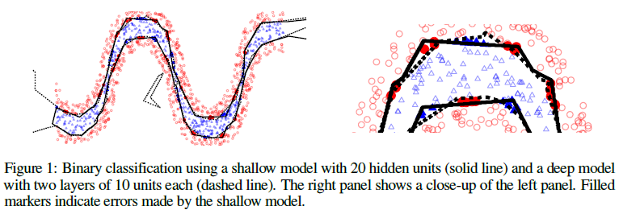

### 2.Feedforward Neural Networks and their Compositional Properties

本节讨论了深度前馈网络通过使用相对较少的计算单元来重新映射其输入空间以创建复杂对称性的能力。分析了深度模型的每一层都能够将其输入的不同区域映射到一个公共输出。这导致了一种复合结构，其中在给定层上产生相同输出的所有输入区域中，有效地复制了较高层上的计算。在输入空间上复制计算的能力随网络层的数量呈指数增长。

#### 2.1 Shallow Neural Networks



根据输入的不同，Rectifier units有两种行为，等于0或者线性。这两个行为之间的边界由超平面给出，来自rectifier层中所有单元的所有超平面的集合形成一个hyperplane arrangement。arrangement中的超平面将输入空间分为几个区域。arrangement的区域数量可以根据arrangement的特征函数给出。在$R^{n_0}$中一个$n_1$的arrangement有最多$\sum_{j=0}^{n_0} {{n_1} \choose j}$个区域。当且仅当超平面处于一般位置时，才能实现这个数量的区域。这意味着由shallow rectifier network（$n_0$的输入和$n_1$的隐藏单元）计算的函数的线性区域的最大数量是$\sum_{j=0}^{n_0} {n_1 \choose j}$。



#### 2.2 Deep Neural Networks

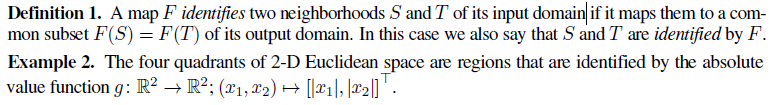

由前馈网络的L层对L-1层的一组激活进行的计算可有效地对导致L-1层相同激活的所有输入空间区域进行。可以选择给定层的输入权重和偏差，使得计算的函数在输入空间中具有最大数量的preimages的前一层的那些激活值上表现出最有趣的行为，从而在输入空间中多次重复有趣的计算和生成complicated-looking的函数。

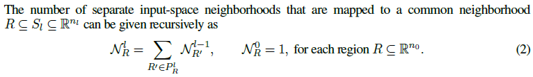

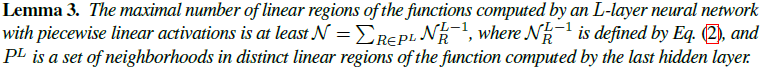

构造具有许多线性区域的函数的想法是使用前L-1个隐藏层来标识许多输入空间邻域，并将它们全部映射到L-1隐层的激活邻域$P^L$，每个激活邻域$P^L$都属于一个不同的最后一个隐藏层的线性区域。

#### 2.34 Identification of Inputs as Space Foldings

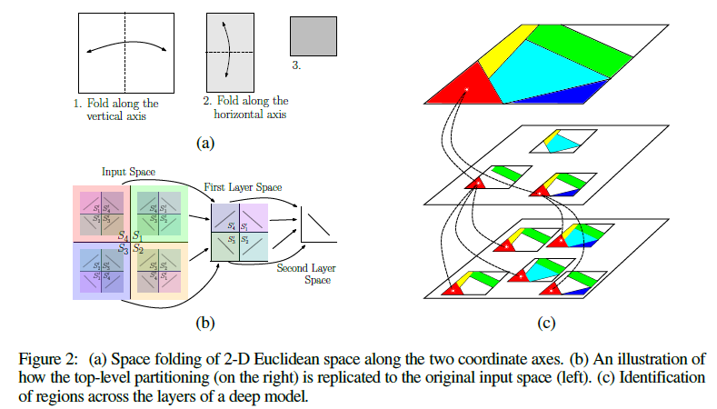

识别两个子集$S$和$S'$的映射$F$可以看成是折叠它domain的一种算子，折叠后$S$和$S'$被映射到相同的输出。如图2所示，absolute value function折叠它自己的domain两次（两个坐标轴各一次）。这种折叠识别了二维欧几里德空间的四个象限。通过组成这样的操作，相同类型的映射可以再次应用于输出，以便重新折叠之前的第一次折叠。深层神经网络的每个隐藏层都和一种折叠算子相关。每个隐藏层折叠前一层的激活空间。反过来，深层神经网络从第一层开始有效地递归折叠其输入空间。这种递归折叠的结果是，在最终折叠空间上计算的任何函数都将应用于由对应于连续折叠的映射所识别的所有的折叠子集。这意味着在深度模型中，最后一层的图像空间的任何划分都被复制到由一连串折叠识别的所有输入空间区域中。

空间折叠不限于沿坐标轴折叠，也不必保留长度。相反，空间被折叠是根据输入权重$W$和偏置$b$中编码的方向和偏移以及在每个隐藏层使用的非线性激活函数。这意味着所识别的输入空间区域的大小和方向可以彼此不同。在激活函数不是分段线性的情况下，折叠操作可能更加复杂。

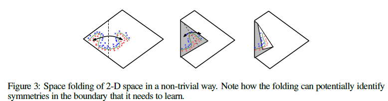

### 3.Deep Rectifier Network

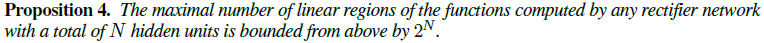

#### 3.1 Illustration of the Construction

考虑一层网络有$n$个rectifiers，$n_0$个输入变量，其中$n \geq n_0$。将rectifier单元集划分为基数为$p=[n / n_0]$的$n_0$个(非重叠)子集，忽略多余单元。考虑第$j$个子集中的单元。

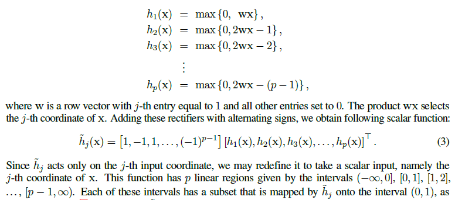

$\tilde h$是由$h$通过与线性函数组合产生的。这个线性函数可以有效地被下一层的预激活函数吸收。因此，我们可以将$\tilde h$视为由当前层计算的函数。作为此rectifier层的单位超立方体输出的函数，由较深层进行的计算将复制到$p^{n_0}$个已识别输入空间超立方体的每一个上。

#### 3.2 Formal Result

可以将上面所描述的construction泛化为一个深层rectifier网络，有$n_0$的输入和$L$层宽度为$n_i$的隐藏层，对于所有$i \in [L]$，$n_i \geq n_0$。那么这个深层rectifier网络的线性区域的最大数量的下限为：

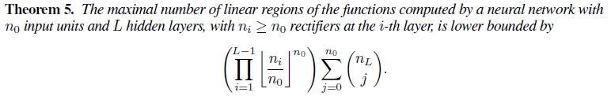

下一个推论给出这些边界的渐近行为的表达式。假设对于所有$i \geq 1$都有$n_0=\Omega (1)$和$n_i=n_0$，一个有$Ln$个隐藏单元的单层网络的区域数量表现为$\Omega (L^{n_0}n^{n_0})$。但是，对于一个深度网络，

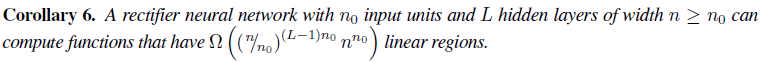

因此，深层模型的线性区域数量呈指数增长(in $L$)，以及呈多项式增长(in $n$)，这比具有$nL$个隐藏单元的浅层模型的线性区域快得多。结果表明，即使$L$和$n$较小，深的rectifier模型也比浅的rectifier模型能够产生更多的线性区域。

### 4.Deep Maxout Networks

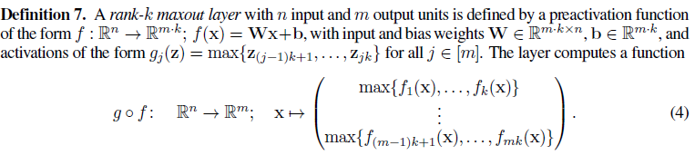

由于两个凸函数的最大值为凸，因此maxout单元和maxout层将计算凸函数。函数集合的最大值被称为*upper envelope*。一个maxout单元线性区域的最大数量等于它的rank(上式中的k)。

maxout层的线性区域是各个maxout单元的线性区域的交集。为了获得该层的线性区域的数量，需要描述每个maxout单元的线性区域的结构，并研究它们可能的交集。Voronoi图可以提升到线性函数的upper envelopes，因此它们描述了由maxout单元生成的输入空间分区。

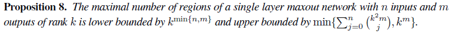

可以通过一个具有两倍数量单元的rectifier层来模拟一个rank-2 maxout层。一个有$L-1$个宽度$n=n_0$的隐藏层的rank-2 maxout网络可以识别出$2^{n_0(L-1)}$个输入空间区域。反过来看，它可以计算有$2^{n_0(L-1)}2^{n_0}=2^{n_0L}$个线性区域的函数。对于rank-k，一个rank-k maxout单元可以从它的输入域识别k个cones，每个cone都与一个对应线性方程$f_i$的梯度$W_i$的positive half-ray $\{rW_i \in R^n: r \in R_+ \}$相邻。

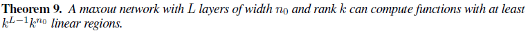

所以深层maxout网络可以计算具有多个线性区域的函数，这些线性区域随层数成指数增长，并且比具有相同数量单元的浅层模型的最大区域数更快地成指数增长。与rectifier模型相似，该指数行为也可以根据网络参数的数量来确定。尽管可以由maxout层计算的某些函数也可以由rectifier层计算，但是从最后一节开始的rectifier构造会出现maxout网络无法计算的函数。

### Reference

[1] https://www.zhihu.com/question/62705160/answer/201377484

[2] https://arxiv.org/pdf/1402.1869.pdf

