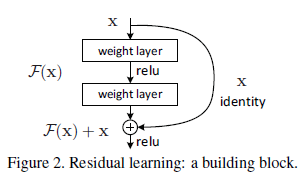
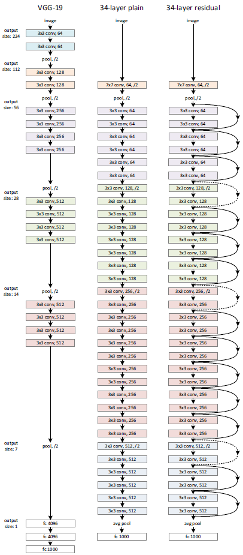
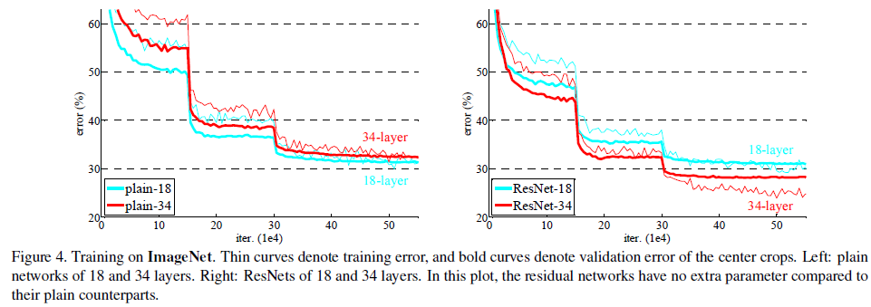
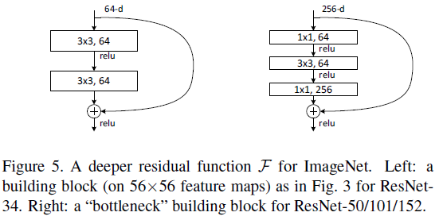
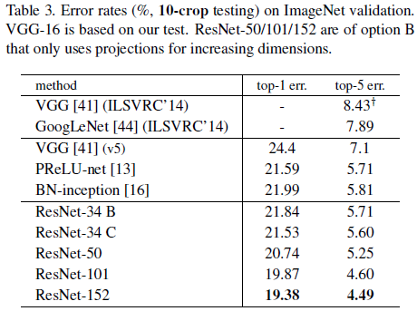
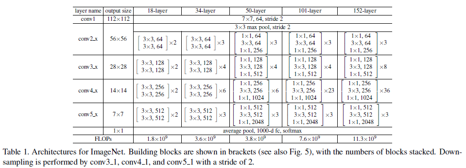
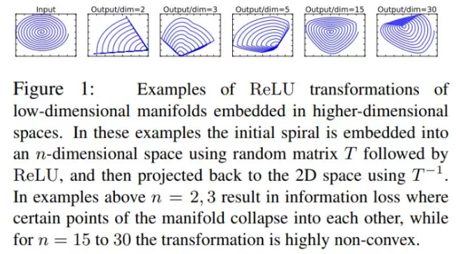

paper地址: [Deep Residual Learning for Image Recognition](https://arxiv.org/pdf/1512.03385v1.pdf)

2015年的ILSVRC冠军是微软的ResNet，152层的ResNet在深度和错误率上都创造了记录。可以说ResNet的出现使得Deep Learning真正的进入了"Deep"的时代，其中所提出的残差学习对之后深度学习的发展产生了深远的影响。

ResNet到底解决的是什么问题？之前看到有些文章说它解决了梯度消失的问题，但是，这很明显是错误的。ResNet的paper中，作者直接指出了梯度消失的问题在BN提出之后基本上已经得到了解决，而ResNet解决的是degradation的问题。所谓degradation就是，随着网络层数的增加，网络的正确率会饱和，然后迅速退化。

> Driven by the significance of depth, a question arises: Is learning better networks as easy as stacking more layers? **An obstacle to answering this question was the notorious problem of vanishing/exploding gradients, which hamper convergence from the beginning. This problem, however, has been largely addressed by normalized initialization and intermediate normalization layers**, which enable networks with tens of layers to start converging for stochastic gradient descent (SGD) with backpropagation. **When deeper networks are able to start converging, a degradation problem has been exposed: with the network depth increasing, accuracy gets saturated (which might be unsurprising) and then degrades rapidly**. Unexpectedly, such degradation is not caused by overfitting, and adding more layers to a suitably deep model leads to higher training error, as reported in and thoroughly verified by our experiments.

所以，网络变深之后会出现两个问题。第一个问题就是梯度消失、爆炸，这个问题在BN出现后被顺利解决。BN层能对各层的输出做归一化，这样梯度在反向层层传递后仍能保持大小稳定，不会出现过小或过大的情况。加入BN后再加大深度是不是就很容易收敛了呢？答案仍是否定的。因为第二个问题，degradation problem，的存在。层数到达一定程度时准确率就会饱和，然后迅速下降，而且这种下降既不是梯度消失引起的，也不是过拟合造成的，而是由于网络过于复杂，以至于光靠不加约束的训练很难达到理想的错误率。degradation problem不是网络结构本身的问题，而是现有的训练方式不够理想造成的。当前广泛使用的训练方法，无论是SGD，还是AdaGrad，还是RMSProp，都无法在网络深度变大后达到理论上最优的收敛结果。

> 神经网络越来越深的时候，反向传递回来的梯度之间的相关性会越来越差，最后接近白噪声。因为我们知道图像是具备局部相关性的，那么可以认为梯度也应该具备类似的相关性，这样更新的梯度才有意义。如果梯度接近白噪声，那梯度更新可能根本就是在做随机扰动。即使BN过后梯度的模稳定在了正常范围内，但梯度的相关性实际上是随着层数增加持续衰减的。而经过证明，ResNet可以有效减少这种衰减。

对于这个问题还有另外两种理解:

- Feature Pyramid Network中提出的，跳连接相加可以实现不同分辨率特征的组合，因为浅层容易有高分辨率但是低级语义的特征，而深层的特征有高级语义，但分辨率就很低了。
- 引入跳连接实际上让模型自身有了更加“灵活”的结构，即在训练过程本身，模型可以选择在每一个部分是“更多进行卷积与非线性变换”还是“更多倾向于什么都不做”，抑或是将两者结合。

可以证明只要有理想的训练方式，更深的网络肯定会比较浅的网络效果要好。证明过程也很简单：假设在一个网络A的后面再添加几层网络形成新的网络B，如果增加的层只是对A的输出做了恒等映射(identity mapping)，即A的输出经过新增的层变成B的输出后没有发生变化，这样网络A和网络B的错误率就是相等的，也就证明了加深后的网络不会比加深前的网络效果差。

> There exists a solution by construction to the deeper model: the added layers are identity mapping, and the other layers are copied from the learned shallower model. The existence of this constructed solution indicates that a deeper model should produce no higher training error than its shallower counterpart.

作者提出了残差结构实现了上述的恒等映射。整个模块除了正常的卷积层输出外，还有一个分支把输入直接连到输出上，该输出和卷积的输出做算术相加得到最终的输出，用公式表达就是$H(x)=F(x)+x$，$x$是输入，$F(x)$是卷积分支的输出，$H(x)$是整个结构的输出。可以证明如果$F(x)$分支中所有参数都是0，$H(x)$就是个恒等映射。残差结构是人为制造的恒等映射，可以让整个结构朝着恒等映射的方向去收敛，确保最终的错误率不会因为深度的变大而越来越差。如果一个网络通过简单的手工设置参数值就能达到想要的结果，那这种结构就很容易通过训练来收敛到该结果，这是一条设计复杂的网络时屡试不爽的规则。

$F$是求和前网络映射，$H$是从输入到求和后的网络映射。比如把5映射到5.1，那么引入残差前是$F'(5)=5.1$，引入残差后是$H(5)=5.1$, $H(5)=F(5)+5$, $F(5)=0.1$。这里的$F'$和$F$都表示网络参数映射，引入残差后的映射对输出的变化更敏感。比如输出从5.1变到5.2，映射$F'$的输出增加了1/51=2%​，而对于残差结构,输出从5.1到5.2，映射$F$是从0.1到0.2，增加了100%。明显后者输出变化对权重的调整作用更大，所以效果更好。残差的思想都是去掉相同的主体部分，从而突出微小的变化。

作者在ImageNet上证明了ResNet的有效性。比较了相同层数的ResNet结构和传统结构的训练效果。下图左侧是一个传统结构的VGG-19网络(每个卷积后都跟了BN)，中间是传统结构的34层网络(每个卷积后都跟了BN)，右侧是34层的ResNet(实线表示直连，虚线表示用1x1卷积进行了维度变化，匹配输入输出的特征数)。

这几种网络训练后的结果如下图所示，左侧的数据看出传统结构的34层网络(红线)要比VGG-19(蓝绿色线)的错误率高，由于每层都加了BN结构，所以错误高并不是由于层级增大后梯度消失引起的，而是degradation problem造成；右侧的ResNet结构可以看到34层网络(红线)要比18层网络(蓝绿色线)错误率低，这是因为ResNet结构已经克服了degradation problem。此外右侧ResNet 18层网络最后的错误率和左侧传统18层网络的错误率相近，这是因为18层网络较为简单，即使不用ResNet结构也可以收敛到比较理想的结果。

像上图左侧那样的ResNet结构只是用于较浅的ResNet网络，如果网络层数较多，靠近网络输出端的维度就会很大,仍使用左侧的结构会造成计算量极大。对较深的网络我们都使用右侧的bottleneck结构，即先用一个1x1卷积进行降维，然后3x3卷积，最后用1x1升维恢复原有的维度。

作者提出并比较了三种identity shortcuts，

> (A) zero-padding shortcuts are used for increasing dimensions, and all shortcuts are parameter-free; (B) projection shortcuts are used for increasing dimensions, and other shortcuts are identity; and (C) all shortcuts are projections.

上图可以看出B比A好一点，这是因为A中的zero-padded dimensions并没有学习到残差。C又比B好一点，这是因为引入了更多的projection shortcuts导致额外的参数。但是，其实三种结构的效果相差不大，这就说明projection shortcuts并不是解决degradation问题的必须条件。所以，为了减少内存/时间复杂度和模型大小，作者并没有选择C，二十使用了B。Identity shortcuts对于不增加bottleneck结构的复杂度非常重要。

作者也构建了更深的ResNet网络，结构如下:

下面贴上一个在知乎上看到的一个特别有意思的对于ResNet的思考。

最近在总结完成语义分割任务的轻量级神经网络时，看到了 MobileNet V2 中对于 ReLU 层的思考，于是我也回过头重新审视 ResNet 之所以 work 的本质原因。以下是一些个人的见解，如有错误，还望及时指正。

在谈及 ResNet 之前，我们先聊聊故事的背景。我们知道，在神经网络中，非线性激活层可以为模型引入了非线性，让模型具有更强的拟合能力。如果只是单纯的线性操作层的叠加，则完全可以等价为一个线性层，这就浪费了深度神经网络的一身好本领。所谓针无两头尖，那么非线性激活层会带来一些什么问题呢？我们以 ReLU 为例来进行说明，其他非线性激活层亦同理。

首先，最直观的，从实验中我们可以注意到一个事实：ReLU 会造成的低维数据的坍塌（collapse）。顾名思义，即是说，低维度的 feature 在通过 ReLU 的时候，这个 feature 会像塌方了一样，有一部分被毁掉了，或者说失去了。能恢复吗？能，但是基本无法百分百还原了。

具体表现出来就是：若是我们对一个 feature，先通过一个给定的变换规则 T，将它映射到它的 embedding space 中，再在该 embedding space 中，利用一个 ReLU 去处理该 feature，最后再把这个 feature 以同样的变换规则（逆方向）给映射回原始空间，我们会发现，这时，这个 feature 已经变得连亲妈都不认得了。

ReLU 这个东西，其实就是一个滤波器，只不过这个滤波器的作用域不是信号处理中的频域，而是特征域。那么滤波器又有什么作用呢？维度压缩，俗话说就是降维啦：如果我们有 $m$ 个 features 被送入 ReLU 层，过滤剩下 $n $个($n<m$)，这不就是相当于对 features 的维度进行了压缩，使其从 $m$ 维变为 $n$维嘛。

那么，为什么低维数据流经非线性激活层会发生坍塌（信息丢失），而高维数据就不会呢？

打个简单但不严谨的比方：大家都有过年抢高铁票的经验吧？几个人（维度低）帮你抢一张票，肯定没有一群人（维度高）帮你抢一张票，成功的概率高啊。几个人里面，大概率全军覆没，没一个能帮上你忙的。而一群人里面，大概率总有那么一个手速惊人的单身青年，帮你抢到你心心念念的回家票。

在数据上也是一个道理，维度低的 feature，分布到 ReLU 的激活带上的概率小，因此经过后信息丢失严重，甚至可能完全丢失。而维度高的 feature，分布到 ReLU 的激活带上的概率大，虽然可能也会有信息的部分丢失，但是无伤大雅，大部分的信息仍然得以保留。所谓留得青山在，不愁没柴烧嘛。更何况被 ReLU 截杀的信息，可能只是一些无用游民（冗余信息）。

那么数据的坍塌，是个很严重的事吗？
那事儿可大了。如果把神经网络比作一个人的话，你这就是给它的某个部位的血管里，丢了个血栓。当信息无法流过 ReLU 时，该神经元的输出就会变为 0。而在反向传播的过程中，ReLU 对 0 值的梯度为 0，即发生了梯度消失，这将导致神经元的权重无法再通过梯度下降法进行更新，这种现象被称为特征退化。所以这个神经元相当于死掉了，丧失了学习能力。我们说，一旦神经元的输出陷入 0 值，就无法恢复了。
那么，我们应该怎么去规避数据的坍塌呢？非线性激活层到底是个什么样的东西？

其实，对于一个数据，利用非线性激活层对其进行激活，其实是从该数据的信息中提取出其潜在的稀疏性，但是这种提取的结果是否正确，就要分情况讨论了。

对于一个 $M$ 维的数据，我们可以将其看成是在 $M$ 维空间中的一个 $M$ 维流形（manifold）。而其中的有用信息，就是在该 $M$ 维空间中的一个子空间（子空间的维度记为 $N $维，$N<=M$）中的一个 $N$ 维流形。非线性激活层相当于压缩了这个 $M$ 维空间的维度（还记得前面提过的维度压缩吗？）。若是该 M 维空间中的 M 维流形本来就不含有冗余信息($M=N$)，那么再对其进行维度压缩，必然导致信息的丢失。

而维度低的数据其实就是这么一种情况：其信息的冗余度高的可能性本来就低，如果强行对其进行非线性激活（维度压缩），则很有可能丢失掉有用信息，甚至丢失掉全部信息（输出为全 0）。

与非线性激活层不同的是，线性激活层并不压缩特征空间的维度。于是，我们得到了一条使用激活层的原则：对含有冗余信息的数据使用非线性激活（如 ReLU），对不含冗余信息的数据使用线性激活（如一些线性变换）。

两种类型的激活交替灵活使用，以同时兼顾非线性和信息的完整性。

由于冗余信息和非冗余信息所携带的有用信息是一样多的，因此在设计网络时，对内存消耗大的结构最好是用在非冗余信息上。

根据以上的原则设计出来的结构，聪明的你想到了什么？ResNet。不得不赞叹 Kaiming He 的天才，ResNet 这东西，描述起来固然简单，但是对它的理解每深一层，就会愈发发现它的精妙及优雅，从数学上解释起来非常简洁，非常令人信服，而且直切传统痛点。

ResNet 本质上就干了一件事：降低数据中信息的冗余度。具体说来，就是对非冗余信息采用了线性激活（通过 skip connection 获得无冗余的 identity 部分），然后对冗余信息采用了非线性激活（通过 ReLU 对 identity 之外的其余部分进行信息提取 / 过滤，提取出的有用信息即是残差）。

其中，提取 identity 这一步，就是 ResNet 思想的核心。从本文的观点来看，因为从数据中拿掉了非冗余信息的 identity 部分，会导致余下部分的信息冗余度变高。这就像从接近饱和的溶液中移走了一部分溶质，会使得剩下的溶液的饱和度降低，一个道理。

在这里也引用一下其他的一些观点，方便大家可以从一个更全面的角度去看这个问题：从特征复用的观点来看，提取 identity 部分，可以让网络不用再去学习一个 identity mapping（虽然是一样的东西，但是毕竟又要从头学起，讲真，换你来试试，这其实真的不容易学到），而是直接学习 residual。这就轻松愉快多了：站在巨人的肩膀上，做一点微小的工作什么的...

既然说了 ResNet 解决的痛点，也顺便多说几句它带来的好处：

由于 identity 之外的其余部分的信息冗余度较高，因此在对其使用 ReLU 进行非线性激活时，丢失的有用信息也会较少，ReLU 层输出为 0 的可能性也会较低。这就降低了在反向传播时 ReLU 的梯度消失的概率，从而便于网络的加深，以大大地发挥深度网络的潜能。

特征复用能加快模型的学习速度，因为参数的优化收敛得快（从 identity 的基础上直接学习残差，总比从头学习全部来得快）。

最后是两个小 tips：

- 如果一个信息可以完整地流过一个非线性激活层，则这个非线性激活层对于这个信息而言，相当于仅仅作了一个线性激活。
- 解决由非线性激活导致的反向传播梯度消失的窍门，就是要提高进行非线性激活的信息的冗余度。

Reference

https://www.zhihu.com/question/64494691

https://zhuanlan.zhihu.com/p/60668529