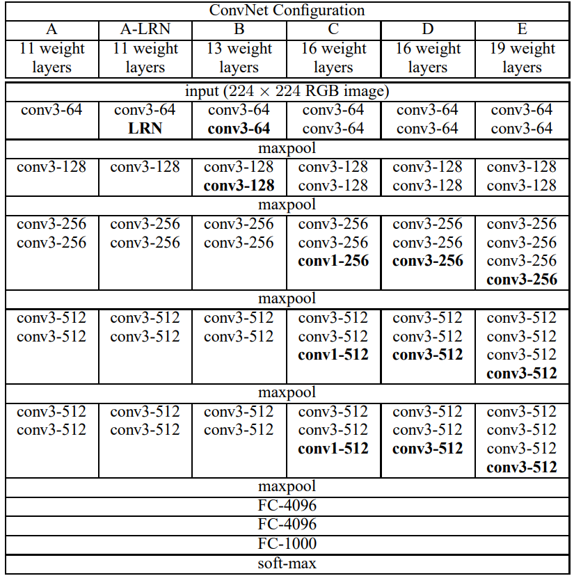
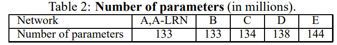

[Very Deep Convolutional Networks for Large-Scale Image Recognition](https://arxiv.org/pdf/1409.1556.pdf)

VGG由牛津大学的Karen Simonyan和Andrew Zisserman提出，在2014年的ILSVRC中top-5 error rate达到了7.3%。VGG可以说是CNN中最重要的模型之一，它强调了深度在CNN模型中的重要作用(我之前的一篇[博客][https://quan-sun.github.io/2019/11/24/为什么神经网络越深越好/#more]介绍了深度对于神经网络的影响)。

VGG研究卷积网络深度的初衷是想搞清楚卷积网络深度是如何影响大规模图像分类与识别的精度和准确率的。VGG在加深网络层数同时为了避免参数过多，所有层都采用$3\times3$的小卷积核，stride设置为1。VGG的输入图像大小为$224 \times 244$，在训练集上对所有图像计算RGB均值，然后将处理后的图像作为传入VGG卷积网络，使用$3\times3$或者$1\times1$的filter，stride设置为1。

## 网络结构

VGG根据权重层的数量的不同分为VGG11/VGG13/VGG16/VGG19。可以看到VGG由不同数量的卷积层和3层全连接层组成，并且不是每个卷积层后面都接有pooling层。

参数的数量如下：

## 网络特点

#### 使用$3\times3$的kernel代替较大的kernel

对于给定的感受野，采用堆积的小卷积核是优于采用大的卷积核，因为多层非线性层可以增加网络深度来保证学习更复杂的模式，而且参数更少。具体来说，使用两个$3\times3$的kernel代替$5\times5$的kernel，三个$3\times3$的kernel代替$7\times7$的kernel。这么做可以在保证具有相同感受野的条件下，提升网络的深度，在一定程度上提升神经网络的效果。

3个stride为1的$3\times3$卷积核的叠加作用可看成一个大小为7的感受野（即3个$3\times3$连续卷积相当于1个$7\times7$卷积），其参数总量为 $3\times(9\times C^2)$ ，但是，直接使用7x7卷积核，其参数总量为 $49 \times C^2$ ，这里 C 是指输入和输出的通道数。$3\times(9\times C^2)$小于$49 \times C^2$，所以3个stride为1的$3\times3$卷积核减少了参数，同时$3\times3$卷积核有利于更好地保持图像性质。

source: https://medium.com/coinmonks/paper-review-of-vggnet-1st-runner-up-of-ilsvlc-2014-image-classification-d02355543a11

#### 局限

- VGG会耗费更多计算资源，并且使用了更多的参数，导致更多的内存占用。其中绝大多数的参数都是来自于第一个全连接层，而且VGG有3个全连接层。
- 在此之前，CNN很少有突破10层的，而VGG在加深CNN的深度方面做出了重要的贡献。但是VGG不能无限制的加深网络，当网络加深到一定层数之后就会出现训练效果褪化、梯度消失等问题。这些问题正是为什么很长一段时间神经网络没办法做到很深的原因。之后会说到BN和ResNet会分别解决这两种问题。