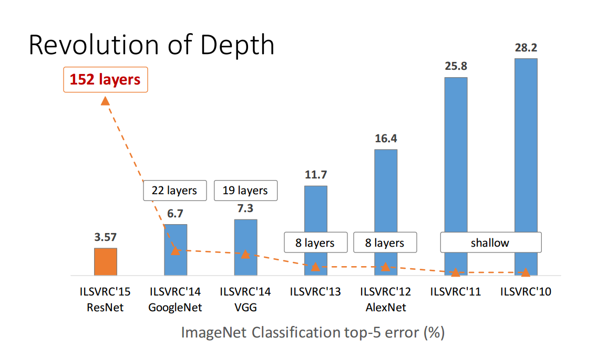
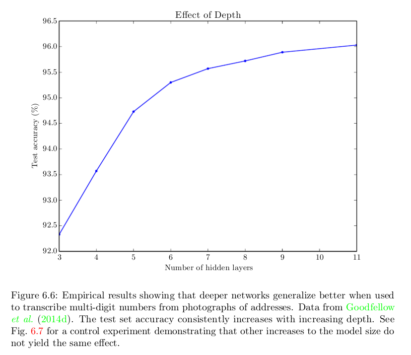

最近在StackExchange上看到的一个帖子，[What is the difference between a neural network and a deep neural network, and why do the deep ones work better?]( https://stats.stackexchange.com/questions/182734/what-is-the-difference-between-a-neural-network-and-a-deep-neural-network-and-w )，讨论的是“深度”对于神经网络的影响。从下面的图片可以看到ImageNet中的冠军模型也越来越深。

在Deep Learning那本书中，我们也能看到一样的结果。

为什么网络越深模型的表现越好呢？下面是不同角度对这个问题的回答。

在知乎的帖子[网络深度对深度学习模型性能有什么影响？]( https://www.zhihu.com/question/313633835 )中，答主言有三从两个方面解释了<u>为什么加深可以提升性能</u>：**1.更好的拟合特征，更强大的表达能力。更深的模型，意味着更好的非线性表达能力，可以学习更加复杂的变换，从而可以拟合更加复杂的特征输入。2.网络更深，每一层要做的事情也更加简单了，可以更好地进行逐层学习。**

同时他也提到了<u>模型变深后带来的两个问题</u>：**1.加深带来的优化问题。深层网络带来的梯度不稳定，网络退化的问题始终都是存在的，可以缓解，没法消除。这就有可能出现网络加深，性能反而开始下降。2.网络加深带来的饱和。随着深度的增加，模型的提升效果逐渐饱和。除此之外，模型加深还可能出现的一些问题是导致某些浅层的学习能力下降，限制了深层网络的学习，这也是跳层连接等结构能够发挥作用的很重要的因素。**模型变深怎么也绕不开ResNet，最近看了很多关于ResNet的文章，对它有了一些新的认识，后面会写一篇ResNet的文章分享。

另一篇知乎的帖子[如何形象的解释深度学习神经网络需要更深而非更广？]( https://www.zhihu.com/question/62705160/answer/201377484 )，一个答主引用Yoshua Begio的paper-[On the Number of Linear Regions of Deep Neural Networks](https://papers.nips.cc/paper/5422-on-the-number-of-linear-regions-of-deep-neural-networks.pdf)的观点（前面的那篇帖子中也提到了这个，后面会写一篇这篇paper的总结）。主要的观点是：**使用ReLU、MaxOut等非线性单元的神经网络在数学上相当于一个分片线性函数，线性区域(linear region)越多，神经网络的非线性就越强，也就更有可能在实际任务中取得好的效果。**

另一个角度的解释是

>通常来说，卷积核的大小通常为3\*3或者5\*5，相对于图片几百乘几百的大小来说，那么小的卷积核一次只能覆盖很小的区域，所以浅层小卷积核只能探测到诸如边或者角这种比较低层次的特征。**随着网络深度的增加，卷积核的有效感受野越来越大，也就意味着高层的卷积核能够覆盖更大尺度上的特征**。也可以认为高层的卷积核将低层卷积核学习到的特征进行了组合。那么问题来了，增加宽度我们说是增加了某一层卷积核的个数，也就意味着探测到的低层次特征理论上变多了。如果仅仅是增加宽度而深度不够，那么最后输出的高层特征仅仅组合了较少的低层特征，比如低层的卷积核探测到了眼睛鼻子和尾巴，第四层可以把眼睛和鼻子组合起来，但是尾巴距离眼睛比较远，可能需要第六层的卷积核的有效感受野才能同时探测到尾巴和眼睛，所以说如果现在网络只有四层，很有可能不能结合距离较远的两个特征。所以说深度很重要，因为更深的卷积核的有效感受野越大，能够组合的低层特征越多。图像分类任务最终的分类依据应该是丰富的低层特征组合而不是分散的低层特征。
>
>作者：Terence Wu

综上所述，模型越来越深背后的理论和实践解释：

1. “a naive answer is that because they work better”；
2. 更深的模型可以更好的拟合特征；
3. 网络更深，每一层要做的事情也更加简单了，可以更好地进行逐层学习；
4. 使用非线性单元（RELU、Maxout等）的神经网络，网络越深，特征空间被分割得到的线性区域越多，模型的表现越好。